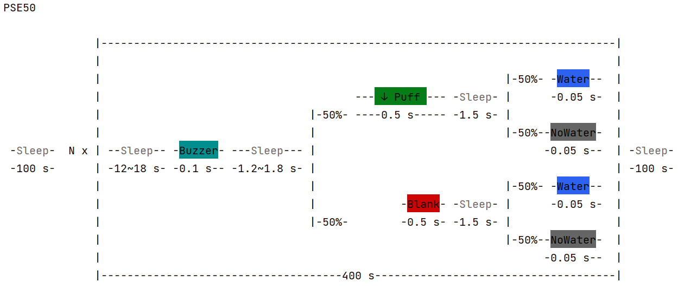

# Pavlovian Causal Association Tasks

Scripts for conducting causal associative learning experiments on Raspberry Pi OS.

## 1. Prerequisites

**Raspberry Pi OS:** Bullseye (32-bit legacy)

Install dependencies using:
```bash
pip install numpy colorist
```

## 2. DIY Tasks

To create custom tasks, refer to `/tasks/task_template.json` for the required format.

### Implemented Tasks
- `pse50`, `sat50`, `sdt50`, `rpse50`, `rsat50`, `rsdt50`
- `shaping05`, `shaping10`, `shaping20`, `shaping35`, `shaping50`

### Example Task


## 3. Configuration

### Modify Configuration
Edit `Config.py` to adjust setup parameters.

### Check Hardware Components
Use `CheckList.py` to verify hardware components before running experiments:
```bash
python CheckList.py -lick     # Check lick sensor
python CheckList.py -puff     # Check puff delivery
python CheckList.py -water    # Check water delivery
python CheckList.py -camera   # Check camera functionality
python CheckList.py -wheel    # Check rotary encoder
```

## 4. Running Tasks

Execute `PavlovTasks.py` to run experiments:
```bash
python PavlovTasks.py -cam -M sat50
```
#### Command Options:
- `-cam` : Enables camera recording
- `-m` or `-M <task_name>` : Specifies the task module (must match a `.json` file in `/tasks`)

Ensure the specified task file exists in the `/tasks` directory.

## 5. Directory Structure

```
pavlovian-causal-association-tasks/
├── tasks
│   ├── task_template.json  
│   └── [your_task_files].json
├── data
│   └── [experiment_data].xlsx / .csv
├── tools
│   ├── Camera.py
│   ├── LickDetector.py
│   └── PositionRecorder.py
├── utils
│   ├── Logger.py
│   ├── PinManager.py
│   └── Utils.py
├── CheckList.py
├── Config.py
├── TaskManager.py
└── PavlovTasks.py
```

## 6. License

This project is licensed under the [MIT License](LICENSE).

